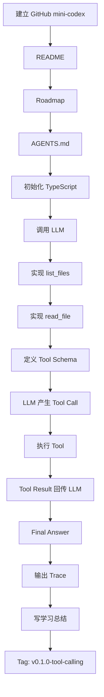

Q:
> 我打算将这次学习之旅完整记录下来，包括学习过程中的代码、资料等。
> 是否应该在github建立一个项目，每个分支代表一个阶段？你有什么建议？
> 比如我打算现在开始`建立 mini-codex 项目，先跑通 Tool Calling`，前期做哪些准备？应该考虑好如何调试（最好可视化调试，比如使用Gradio等工具是否都要提前接好？）

A:

可以，而且我非常建议你把这次学习做成一个**长期 GitHub 工程仓库**。但我不建议“每个阶段永久占一个分支”。

更合适的是：

> **一个持续演进的 `main` + 功能分支（Feature Branch）开发 + 每个学习阶段打 Tag / Release + 文档完整记录过程。**

这样它最终既是学习笔记，也是你的 **Agent Engineering 作品集**。

---

# 1. Git 应该怎么组织

不太推荐：

```
branch/tool-calling
branch/agent-loop
branch/rag
branch/eval
branch/multi-agent
```

因为分支（Branch）本质上是并行开发线，不太适合保存“历史学习阶段”。

时间长了会出现：

```
tool-calling 分支
      \
       agent-loop 分支
            \
             rag 分支
                  \
                   eval 分支
```

历史版本之间关系反而不好管理。

### 我更推荐

```
main
 │
 ├── feature/tool-registry
 ├── feature/tool-runtime
 ├── feature/agent-loop
 │
 └── 合并后删除
```

然后每个里程碑打 Git Tag：

```
v0.1.0-tool-calling
v0.2.0-tool-runtime
v0.3.0-agent-loop
v0.4.0-codebase-agent
v0.5.0-context-memory
v0.6.0-rag
v0.7.0-eval
v1.0.0
```

这样随时可以：

```
git checkout v0.1.0-tool-calling
```

看看自己最初的 Tool Calling 是怎么写的。

最终 Git 历史天然就是：

```
v0.1 Tool Calling
      ↓
v0.2 Tool Runtime
      ↓
v0.3 Agent Loop
      ↓
v0.4 Codebase Agent
      ↓
v0.5 Context / Memory
      ↓
v0.6 RAG
      ↓
v0.7 Eval
      ↓
v1.0 Agent Engineering Platform
```

这比阶段分支漂亮很多。

---

# 2. 这个仓库不要只放代码

我建议把它定位成：

> **Mini Codex：从零学习 Agent Engineering 的完整工程记录。**

可以叫：

```
mini-codex
```

或者更长期一点：

```
agent-engineering-lab
```

我个人更倾向于：

```
mini-codex
```

名字简单，而且目标很明确。

目录先这样：

```
mini-codex/
├── src/
│   ├── llm/
│   ├── tools/
│   ├── agent/
│   └── shared/
│
├── tests/
│
├── docs/
│   ├── roadmap.md
│   ├── architecture.md
│   │
│   ├── learning/
│   │   ├── 01-tool-calling.md
│   │   ├── 02-tool-runtime.md
│   │   ├── 03-agent-loop.md
│   │   ├── 04-context.md
│   │   ├── 05-memory.md
│   │   ├── 06-rag.md
│   │   └── 07-eval.md
│   │
│   ├── decisions/
│   │   └── 001-why-typescript.md
│   │
│   └── traces/
│
├── examples/
│
├── .env.example
├── README.md
├── AGENTS.md
├── package.json
└── tsconfig.json
```

这里有三个东西以后特别值钱。

### `learning/`

记录：

```
# Tool Calling

## 我原来的理解

## 实际实现后发现

## 核心原理

## 遇到的问题

## 为什么这样设计

## 下一步
```

这比抄教程有效得多。

---

### `decisions/`

这是架构决策记录（Architecture Decision Record，ADR）。

例如：

```
001-why-typescript.md
002-tool-schema-use-zod.md
003-why-not-langgraph-yet.md
004-why-agent-loop-has-max-steps.md
```

以后回头看会非常有价值。

---

### `traces/`

保存典型 Agent 执行过程：

```
traces/
├── v0.1/
│   ├── read-project.json
│   └── analyze-package.json
├── v0.2/
└── v0.3/
```

以后做 Agent Eval（智能体评测）时，这些数据可以直接用。

---

# 3. 第一阶段不要急着造“完整项目”

你现在这个阶段：

> 建立 Mini Codex，先跑通 Tool Calling

我建议目标严格限制成：

```
输入问题
   ↓
LLM
   ↓
决定调用 Tool
   ↓
执行 Tool
   ↓
Tool Result
   ↓
返回给 LLM
   ↓
Final Answer
```

只支持两个工具：

```
list_files
read_file
```

甚至暂时不要：

```
❌ write_file
❌ Shell
❌ Git
❌ MCP
❌ RAG
❌ Memory
❌ Multi-Agent
❌ Web UI
```

否则第一阶段很快就膨胀了。

---

# 4. 第一阶段正式开发前，我建议先写 4 份东西

不用很多，每份几十行即可。

## ① `README.md`

说明：

```
# Mini Codex

通过从零实现一个简化版 Coding Agent，
系统学习 Agent Engineering。

## 当前阶段

v0.1 Tool Calling

## 当前目标

支持：

- list_files
- read_file
- LLM Tool Calling
- Tool Result 回传
- Final Answer

## 暂不支持

- Agent Loop
- RAG
- Memory
- MCP
- Multi-Agent
```

这一段“暂不支持”很重要。

它可以防止你，也防止 Claude / Codex：

> 顺手把整个 Agent 平台都给造出来。

---

# 5. 再写一份 Roadmap

例如：

```
# Roadmap

## v0.1 Tool Calling

理解：

- Tool Definition
- JSON Schema
- Tool Call
- Tool Result

产出：

- list_files
- read_file

---

## v0.2 Tool Runtime

理解：

- Tool Registry
- Validation
- Timeout
- Error Handling

---

## v0.3 Agent Loop

理解：

- Observe
- Act
- Tool Result
- Continue
- Finalize
- Max Steps

---

## v0.4 Codebase Agent

支持：

- search_code
- read_file
- list_files
- git_diff
- run_test

---

## v0.5 Context & Memory

---

## v0.6 RAG

---

## v0.7 Eval
```

以后千万不要随便跳阶段。

---

# 6. 调试能力确实应该从第一天考虑

这个问题你问得非常好。

Agent 系统和普通 CRUD 最大区别之一就是：

> **最终答案错误，不一定是最后一次 LLM Call 的问题。**

可能是：

```
Prompt
 ↓
Context
 ↓
模型决策
 ↓
Tool Selection
 ↓
Tool Arguments
 ↓
Tool Execution
 ↓
Tool Result
 ↓
下一次模型调用
 ↓
Final Answer
```

任何一步都可能有问题。

所以第一天就应该建立：

> Trace First

但注意：

**Trace First ≠ 第一周搭一套 Langfuse。**

---

# 7. 第一版调试我建议极其简单

控制台直接输出：

```
────────────────────────────────
[STEP 1]

USER
分析这个项目是干什么的

MODEL
finish_reason: tool_calls

TOOL CALL
name: list_files

arguments:
{
  "path": "."
}

TOOL RESULT
[
  "package.json",
  "src",
  "README.md"
]

────────────────────────────────
[STEP 2]

MODEL
finish_reason: tool_calls

TOOL CALL
name: read_file

arguments:
{
  "path": "package.json"
}

TOOL RESULT
...

────────────────────────────────
[STEP 3]

FINAL
这是一个……
```

同时保存成 JSON：

```
{
  "taskId": "xxx",
  "startedAt": "...",
  "steps": [
    {
      "type": "model",
      "input": {},
      "output": {},
      "latency": 836
    },
    {
      "type": "tool",
      "tool": "list_files",
      "arguments": {
        "path": "."
      },
      "result": {},
      "latency": 12
    }
  ]
}
```

这已经足够你学习前两个阶段。

---

# 8. Gradio 我反而不建议现在接

尤其你的 Mini Codex 如果使用：

```
Node.js + TypeScript
```

Gradio 是 Python 技术栈。

为了一个调试页面提前引入：

```
Node Agent Runtime
        ↓
HTTP
        ↓
Python
        ↓
Gradio
```

纯属给第一阶段增加认知负担。

**得不偿失。**

---

# 9. 但“可视化 Agent Trace”非常值得做

只是建议放到：

> **v0.3 Agent Loop 跑通之后。**

到时候做一个非常简单的页面：

```
┌──────────────────────────────────────┐
│ Task: 分析项目登录逻辑                 │
├──────────────────────────────────────┤
│ Step 1                               │
│ 🤖 Model                             │
│ 决定调用 search_code                  │
├──────────────────────────────────────┤
│ Step 2                               │
│ 🔧 search_code                       │
│ query: login                         │
│ 23ms                                 │
├──────────────────────────────────────┤
│ Step 3                               │
│ 🤖 Model                             │
│ 决定调用 read_file                    │
├──────────────────────────────────────┤
│ Step 4                               │
│ 🔧 read_file                         │
│ src/auth/auth.service.ts             │
├──────────────────────────────────────┤
│ Step 5                               │
│ ✅ Final Answer                      │
└──────────────────────────────────────┘
```

你完全可以用自己最熟悉的：

```
Vue 3 + Vite
```

做。

这样反而还会帮助你真正理解 Agent Trace。

---

# 10. 更进一步，调试系统可以这样演进

不要一步到位。

### v0.1

```
console.log
```

↓

### v0.2

```
Structured Log
+
trace.json
```

↓

### v0.3

```
Trace Viewer
```

↓

### v0.5

```
SQLite / PostgreSQL
```

↓

### v0.7

```
Eval Dashboard
```

↓

以后再研究：

```
Langfuse
OpenTelemetry
Phoenix
其他 Observability 平台
```

你会真正理解这些平台**到底在帮你解决什么问题**。

而不是：

> 教程说 Agent 要接 Langfuse，所以我第一天先装 Langfuse。

---

# 11. 第一阶段技术栈我建议尽量克制

可以直接：

```
Runtime
Node.js

Language
TypeScript

LLM SDK
OpenAI SDK / Anthropic SDK

Schema
Zod

Testing
Vitest

Formatting
ESLint + Prettier

CLI
原生 process.argv
或者 Commander

Logging
先自己实现简单 Logger
```

暂时甚至不用：

```
NestJS
Prisma
MySQL
Redis
Vue
Docker
```

虽然这些你都会。

因为现在要研究的是：

> Agent 的核心机制。

不是再次证明自己会搭 Web 项目。

---

# 12. 我甚至建议暂时不用 LangChain / LangGraph

这个尤其重要。

第一阶段直接 SDK：

```
const response = await client.responses.create(...)
```

自己处理：

```
Tool Definition
Tool Call
Tool Result
Messages
Loop
```

因为你这一趟学习的核心就是：

> **把 Agent 框架藏起来的东西重新实现一次。**

等 v0.3 / v0.4 后再学习 LangGraph。

到时候你会产生非常明显的感觉：

```
噢，StateGraph 原来是在解决这个。

噢，Checkpoint 原来就是把我这个 State 持久化了。

噢，ToolNode 原来是封装了我这里这套逻辑。
```

这就是你真正需要的认知提升。

---

# 13. AI 在这个仓库里也要有使用规范

建议一开始就写：

```
AGENTS.md
```

其中明确告诉 Codex / Claude：

```
# 项目定位

这是一个 Agent Engineering 学习项目。

目标优先级：

1. 理解 Agent 原理
2. 保持实现简单
3. 可读性优先
4. 不追求生产级完整性

## 开发原则

- 不主动引入 Agent Framework
- 不主动引入 RAG
- 不主动引入 MCP
- 不主动引入数据库
- 不主动做 UI
- 不跨越当前 Roadmap 阶段
- 复杂逻辑必须说明设计原因
- Agent 核心代码要求有解释性注释

## AI 协作原则

AI 可以实现代码，但必须：

- 解释核心设计
- 给出关键调用链
- 指出当前实现的限制
- 不进行超出当前阶段的过度设计
```

这个文件对你这次学习非常重要。

因为 AI 特别容易：

> “既然你要 Tool Runtime，那我顺便给你抽象 Provider、EventBus、DI、Plugin、Persistence……”

最后你面对一个自己都不想看的框架。

---

# 14. 第一阶段完整开发流程，我建议这样跑

````

````

注意最后两个：

```
写学习总结
Tag
```

**也是开发任务的一部分。**

---

# 15. v0.1 的 Definition of Done

在开始前就把验收标准写好。

例如：

### 功能

- LLM 可以调用 `list_files`
- LLM 可以调用 `read_file`
- Tool Arguments 有 Schema 校验
- Tool Result 可以重新返回模型
- 模型可以得到 Final Answer

### 调试

能够看到：

- Model Input
- Model Output
- Tool Name
- Tool Arguments
- Tool Result
- Latency

### 测试

至少测试：

- 正常读取
- 文件不存在
- 非法参数

### 学习成果

自己能够解释：

1. Tool Schema 是给谁看的？
2. 谁真正执行 Tool？
3. LLM 为什么不能直接执行函数？
4. Tool Result 为什么要重新传给 LLM？
5. Structured Output 和 Tool Calling 有什么关系？

满足这些：

```
git tag v0.1.0-tool-calling
```

第一阶段结束。

---

# 我最推荐你的长期仓库形态

最后它可能演变成：

```
mini-codex

v0.1
Tool Calling

v0.2
Tool Runtime

v0.3
Agent Loop

v0.4
Codebase Agent

v0.5
Context Engineering + Memory

v0.6
Codebase RAG

v0.7
Agent Eval

v0.8
MCP / Skill

v0.9
Subagent

v1.0
Agent Engineering Platform
```

而每个版本都有：

```
Code
+
Architecture
+
Learning Notes
+
Trace
+
Tests
+
Git Tag
```

如果坚持做完，这个仓库的价值会远远大于“我参加过某某 Agent 培训班”。

因为别人看到的是课程证书；你能直接展示：

> **我从零实现 Agent Runtime，每一个设计阶段、错误、Trace、架构演进和 Eval 数据全部在这里。**

这才真正符合你这次学习“从会使用 Agent → 理解和构建 Agent”的目标。
